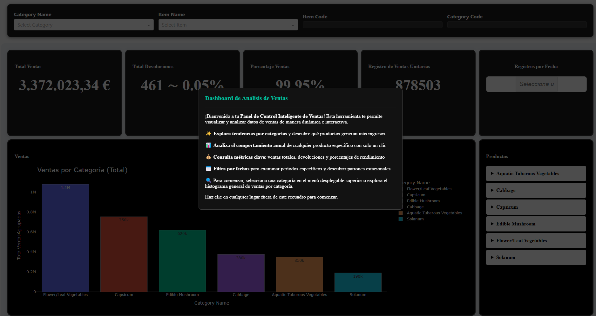

📊 DashBoard de Análisis de Datos  
Este repositorio contiene una aplicación interactiva construida con Plotly Dash para analizar y visualizar datos desde archivos CSV.

Pantallazo Principal - Bienvenida
¡Bienvenido al Dashboard de Análisis de Productos!
Este panel ha sido diseñado para brindarte una visión completa y dinámica sobre el comportamiento de los productos en tu inventario, incluyendo ventas, devoluciones, historial anual y más. Al ingresar, verás un resumen general de todos los datos, sin necesidad de seleccionar filtros. Sin embargo, puedes acceder a vistas más detalladas utilizando las herramientas interactivas descritas a continuación.

Estructura del Proyecto
El proyecto está organizado de la siguiente manera:

appDahs.py: Archivo principal que configura y ejecuta la aplicación Dash.

analyct.ipynb: Jupyter notebook que realiza análisis y limpieza de los datos.

dataset/: Carpeta que contiene los archivos CSV con los datos.

assets/: Carpeta con archivos CSS y JavaScript opcionales para personalizar el diseño de Dash.

graficasV/: Entorno virtual donde se gestionan las dependencias.

README.md: Este archivo con la documentación del proyecto.

requirements.txt: Archivo con las dependencias necesarias para ejecutar el proyecto.

Funcionalidades Interactivas
Vista General y Detalles: El dashboard muestra un resumen general sin filtros al cargarlo, pero permite aplicar filtros a través de casillas de colores que interactúan entre sí.

Casilla Amarilla: Filtra productos por categoría, nombre o ID.

Casilla Azul: Muestra estadísticas como ventas y devoluciones.

Casilla Rosada: Permite filtrar por fechas.

Casilla Roja: Muestra un histograma del producto seleccionado, segmentado por año.

Casilla Morada: Muestra funciones agrupadas, como los 10 productos más vendidos.

Funciones del Dashboard
Filtrado de Datos: Los usuarios pueden seleccionar diferentes categorías y productos desde un menú desplegable, lo que actualiza las gráficas y métricas que se muestran.

Histograma de Ventas: El histograma muestra las ventas agrupadas por categorías, y se actualiza dinámicamente con base en las selecciones de los usuarios.

Gráficas Detalladas: El dashboard también permite mostrar ventas por año para productos específicos, y los 10 productos más vendidos en una categoría dada.

Descripción del Código
El código en el archivo appDahs.py crea un dashboard interactivo con las siguientes funcionalidades:

Carga de Datos: Los datos se cargan desde archivos CSV utilizando pandas, y se realizan algunos cálculos previos, como la creación de una nueva columna de fecha.

Funciones para Graficar:

graficar_histograma(): Muestra las ventas totales por categoría.

graficar_item_por_anio(item_code): Muestra las ventas por año para un producto específico.

graficar_top_productos(category_code): Muestra los 10 productos más vendidos de una categoría.

Callbacks de Dash:

Los callbacks permiten actualizar la interfaz de usuario en función de las interacciones de los usuarios, como la selección de categoría o producto.

El modal de bienvenida se puede ocultar cuando el usuario hace clic en cualquier parte fuera del modal.

Requisitos y Ejecución
Para ejecutar el proyecto, se deben cumplir los siguientes requisitos:

Python 3.8+

pip

Instalación:

Clonar el repositorio:
git clone https://github.com/JosePicalua/DataVisualizationDashboard

Instalar las dependencias:
pip install -r requirements.txt

Ejecutar el archivo principal:
python appDahs.py

🎨 2. Funciones según el color de cada casilla/cuadrícula

📊 2.1 Vista General y Detalles
Al cargar el dashboard por primera vez, se mostrará un resumen total sin filtros aplicados.

Para acceder a información más específica, simplemente utiliza las casillas de colores para aplicar filtraciones según tus necesidades.

🟨 2.2 Casilla Amarilla: Filtrado de Productos
Permite filtrar por categoría, nombre del producto o identificación.

Al hacer clic, activa interacciones con otras casillas:

🟦 Casilla Azul: Muestra estadísticas como cantidad de ventas, devoluciones y porcentajes relacionados.

🌸 Casilla Rosada: Permite filtrar por fechas específicas para un análisis temporal.

🔴 Casilla Roja: Despliega un histograma del producto seleccionado, segmentado por año.

🟪 2.3 Casilla Morada: Funciones Agrupadas
Despliega funciones agrupadas por categoría.
Presenta un listado de los 10 productos más vendidos a lo largo de su existencia.

